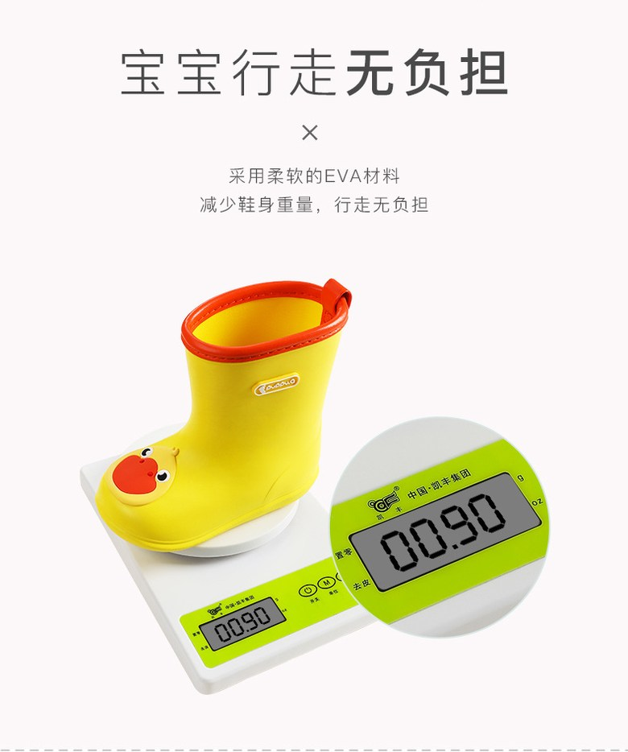
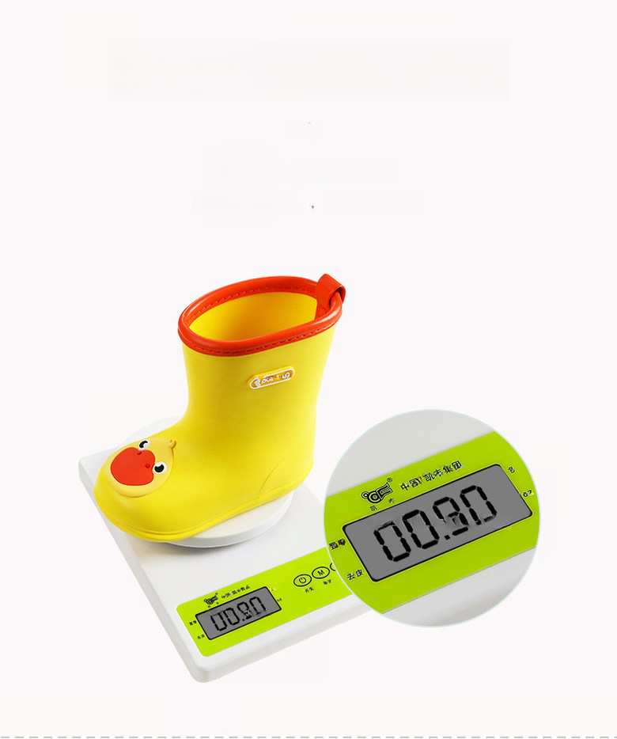

# Pdp-creator
product detail page 생성에 필요한 라이브러리와 함수를 보아봅니다.

# 이미지에서 텍스트 제거 전처리 함수 실행방법
1. clipdrop에서 계정을 생성한 후, credit을 얻는다.
https://clipdrop.co/apis/account

2. 실행한다.
```
python3 remove_text.py input/chinese-dpp-image.jpeg {CLIPDROP-KEY}
```

| Before | After |
| ------ | ----- |
|  |  |

